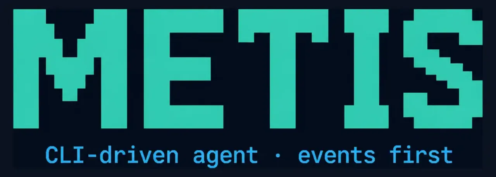

# Open Metis

<p align="center">
  
</p>

Fast, lightweight **open-source AI coding CLI**.  
Agent loop on the host; `run_command` uses the `@metis/os` path. **No Docker required.**

> Early project — GitHub Issues are the product backlog. Please file bugs and UX friction.

**Honest status (v0.1):**

- **OS fence is MVP**: default `METIS_EXEC_BACKEND=os` currently **passthrough to the host shell** (marks `METIS_SANDBOX=os`). Not Seatbelt/Landlock yet. `run_command` still asks for approval; there is **no strong isolation**.
- **REPL has no cross-turn memory**: each `›` line is an independent task (tool multi-turns inside one task still work). Prefer `metis run "..."` for one-shot jobs.

## Packages

| Package | Role |
|---|---|
| `@metis/protocol` | NDJSON event contract |
| `@metis/core` | Agent loop (zero default business tools) |
| `@metis/tools-coding` | `read_file` / `write_file` / `run_command` |
| `@metis/os` | Local OS fence backend (MVP ≈ local shell) |
| `@metis/ui-ink` | Terminal UI (Ink) |
| `@metis/cli` | `metis` binary |

## Quick start

Requirements: **Node ≥ 22**, **pnpm 9**.

```bash
git clone https://github.com/starcloud530/open-metis.git
cd open-metis
cd open-metis
pnpm install

export METIS_API_KEY=sk-...
export METIS_BASE_URL=https://api.openai.com/v1
export METIS_MODEL=gpt-4o-mini

./metis run "用一句话介绍你自己" --plain
# or mock (no API key):
./metis run "hello" --mock --plain
```

Interactive REPL (no cross-turn memory yet):

```bash
./metis
```

Install onto PATH (build injects version from `VERSION`):

```bash
pnpm install:global   # ~/.local/bin/metis
```

## Exec backend

| `METIS_EXEC_BACKEND` | Behavior |
|---|---|
| `os` (default) | OS fence **path** — MVP = host shell + `METIS_SANDBOX=os` marker |
| `local` | Bare `child_process` escape hatch (same isolation today) |

Next: Seatbelt / Landlock + `metis.sandbox.json` — see `metis-os/README.md`.

## Develop

```bash
pnpm test
pnpm --filter @metis/cli build
./metis --version   # reads VERSION → 0.1.0
```

## Contributing

See [CONTRIBUTING.md](./CONTRIBUTING.md). Open an issue before large PRs.

## License

Apache-2.0 — see [LICENSE](./LICENSE).
